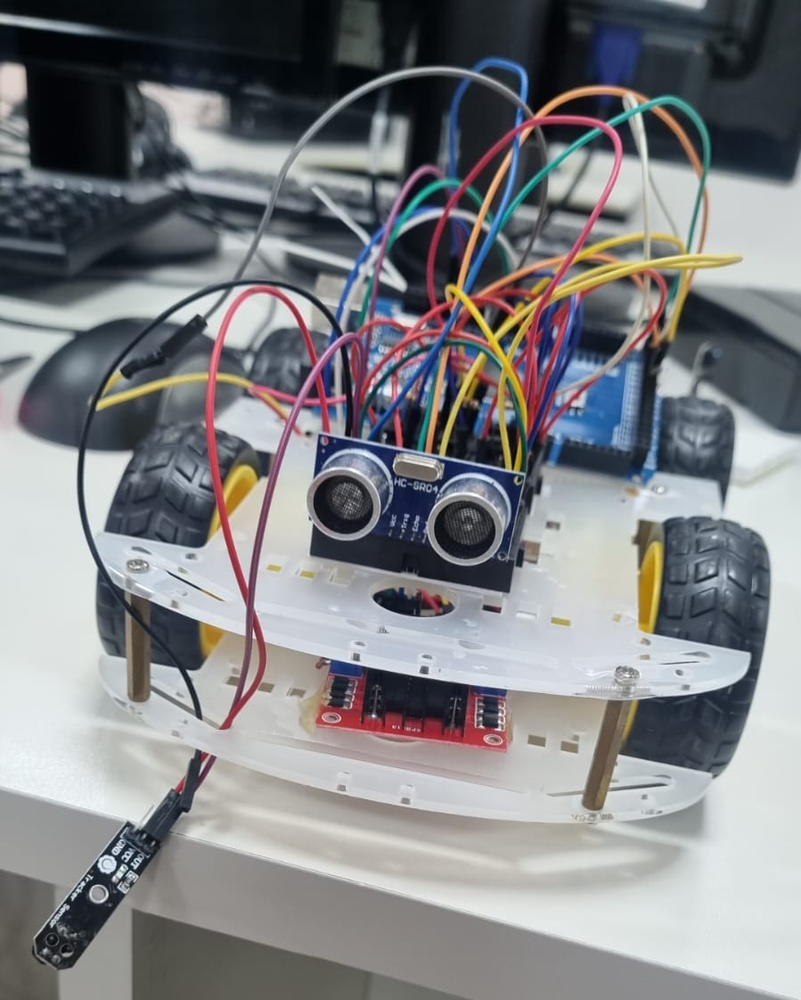

# SUMÔ AUTÔNOMO

## Objetivo
Desenvolvimento de um Sumô Autônomo para o Portas Abertas de 2026 da UNIFESP, representado pela Disciplina **Sistemas Embarcados**.

## Sobre o projeto
O sumô autônomo utiliza um sistema embarcado baseado em Arduíno para controlar os motores e interpretar os dados recebidos pelos sensores. A partir dessas informações, ele toma decisões de movimentação para localizar o adversário, atacar e evitar sair da arena.

## Componentes
* 1 Arduino Mega 2560;
* 1 Sensor Ultrassônico;
* 1 Sensor Infravermelho;
* 4 Motores DC 3-6V com caixa de redução e eixo duplo;
* 1 Módulo Ponte H L298N;
* 3 Push Button;
* 3 Resistores de 10 kΩ;
* 1 Bateria Lipo 3s 2200mah 11.1V com conector XT60;
* 1 Chassi de Sumô (carcaça, 4 rodas, parafusos);
* 1 Power Button;
* 1 Mini Protoboard Breadboard 170 Pontos;
* MUITOS Jumpers macho-macho e macho-fêmea.
